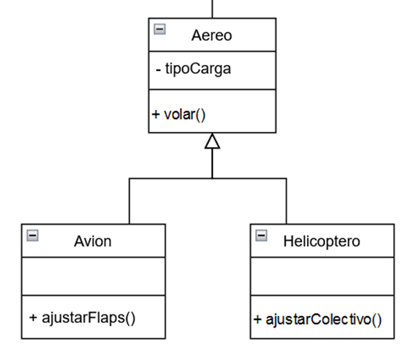

# UT 4: DIAGRAMAS DE ESTADO

- [UT 4: DIAGRAMAS DE ESTADO](#ut-4-diagramas-de-estado)
      - [mapa](#mapa)
  - [introducción](#introducción)
    - [1. ¿Por qué modelamos?](#1-por-qué-modelamos)
    - [2. Los diagramas de clases y el desarrollo de software](#2-los-diagramas-de-clases-y-el-desarrollo-de-software)
  - [POO](#poo)
    - [3. Diseño y Programación Orientada a Objetos](#3-diseño-y-programación-orientada-a-objetos)
    - [4. Elementos de la Programación Orientada a Objetso](#4-elementos-de-la-programación-orientada-a-objetso)
      - [**Clases y Objetos:**](#clases-y-objetos)
      - [**Métodos y Mensajes:**](#métodos-y-mensajes)
      - [**Atributos y Estado:**](#atributos-y-estado)
      - [**Constructores**](#constructores)
  - [5. Características de los objetos](#5-características-de-los-objetos)
  - [UML](#uml)
    - [6. Diagramas de clases](#6-diagramas-de-clases)
    - [Relaciones entre clases](#relaciones-entre-clases)
    - [Consecuencias sobre el código Java](#consecuencias-sobre-el-código-java)
    - [Otros modificadores](#otros-modificadores)


####  [mapa](./mapa_copy.html)

## introducción

### 1. ¿Por qué modelamos?


La modelación antes de la implementación es una práctica común en el desarrollo de software y proporciona varios beneficios clave que contribuyen al éxito del proyecto. Aquí hay algunas razones fundamentales por las cuales se realiza la modelación antes de la implementación:


1. **Clarificación de Requisitos:**
   - La modelación ayuda a comprender y clarificar los requisitos del sistema. Al representar visualmente las entidades, relaciones y comportamientos esperados, los stakeholders pueden revisar y validar sus expectativas antes de que se realice la implementación.

2. **Visualización del Diseño:**
   - Los modelos proporcionan una representación visual de la arquitectura y el diseño del sistema. Esto facilita la comunicación entre los miembros del equipo de desarrollo, permitiéndoles entender rápidamente la estructura y las interacciones planeadas.

3. **Identificación de Problemas de Diseño:**
   - La modelación permite identificar posibles problemas de diseño antes de la implementación. Al visualizar la estructura y las relaciones, es más fácil detectar conflictos, redundancias o áreas de mejora en el diseño.

4. **Facilita la Toma de Decisiones:**
   - Los modelos proporcionan una base para la toma de decisiones informadas. Los diseñadores y stakeholders pueden evaluar diferentes opciones de diseño, comparar alternativas y tomar decisiones basadas en una comprensión clara de las implicaciones.

5. **Alineación con Objetivos del Negocio:**
   - La modelación ayuda a garantizar que el diseño del software esté alineado con los objetivos del negocio. Permite visualizar cómo las funcionalidades planeadas satisfacen los requisitos empresariales y facilita la comunicación entre los equipos técnicos y no técnicos.

6. **Ahorro de Recursos:**
   - Identificar y corregir problemas de diseño antes de la implementación puede ahorrar tiempo y recursos. La modelación ayuda a evitar costosos retrabajos y cambios de último minuto al proporcionar una oportunidad para revisar y validar el diseño antes de que se invierta en la implementación.

7. **Documentación Efectiva:**
   - Los modelos actúan como una forma de documentación efectiva. Proporcionan una representación visual que es fácil de entender y mantener. Los desarrolladores pueden referirse a los modelos durante la implementación para garantizar que sigan las pautas y la visión del diseño.

8. **Mejora la Colaboración:**
   - La modelación fomenta la colaboración entre los miembros del equipo y los stakeholders. Proporciona un lenguaje común para discutir y compartir ideas, facilitando la comprensión mutua y reduciendo malentendidos.

En resumen, modelar antes de implementar es una práctica valiosa que contribuye a la calidad, la eficiencia y el éxito general de un proyecto de desarrollo de software al proporcionar una base sólida para la toma de decisiones y la ejecución efectiva.

### 2. Los diagramas de clases y el desarrollo de software


Los diagramas de clases se utilizan en la fase de diseño del desarrollo de software por varias razones fundamentales que ayudan a estructurar y visualizar la arquitectura y el diseño del sistema. Aquí hay algunas razones clave:

1. **Visualización de la Estructura del Sistema:**
   - Los diagramas de clases proporcionan una representación visual de las clases en el sistema, sus atributos y sus relaciones. Esto facilita la comprensión de la estructura general del sistema y cómo se organizan las entidades clave.

2. **Identificación de Clases y Relaciones:**
   - Permiten identificar las clases que formarán parte del sistema y las relaciones entre ellas. Esto ayuda a los diseñadores a tomar decisiones sobre cómo organizar las funcionalidades del sistema en unidades cohesivas y acopladas de manera adecuada.

3. **Diseño de Interfaces y Colaboraciones:**
   - Los diagramas de clases permiten definir las interfaces de las clases y cómo interactúan entre sí. Esto es crucial para establecer la comunicación y las colaboraciones entre diferentes partes del sistema, ayudando a prever y planificar la implementación de funciones específicas.

4. **Modelado de Atributos y Métodos:**
   - Los atributos y métodos de las clases se modelan en los diagramas de clases, lo que proporciona una visión detallada de la implementación prevista. Esto es esencial para garantizar que las clases tengan las responsabilidades adecuadas y que los datos y comportamientos estén bien encapsulados.

5. **Facilita la Comunicación del Diseño:**
   - Los diagramas de clases sirven como una herramienta de comunicación efectiva entre los miembros del equipo de desarrollo. Los diseñadores pueden expresar sus ideas y decisiones de diseño de manera visual y comprensible, lo que facilita la colaboración y la discusión en el equipo.

6. **Identificación de Patrones de Diseño:**
   - Al utilizar diagramas de clases, los diseñadores pueden identificar patrones de diseño que podrían ser aplicados para resolver problemas comunes de diseño de manera efectiva y eficiente.

7. **Base para la Implementación:**
   - Los diagramas de clases sirven como una guía sólida para la implementación del código. Los desarrolladores pueden referirse a estos diagramas para entender la estructura del sistema y traducir el diseño en código de manera coherente.

En resumen, los diagramas de clases en la fase de diseño son esenciales para planificar y comunicar la arquitectura y el diseño del sistema, lo que ayuda a construir un código más estructurado, modular y mantenible.

## POO

### 3. Diseño y Programación Orientada a Objetos

La programación estructurada se centra en la organización de un programa en funciones y procedimientos, donde cada función realiza tareas específicas. En este paradigma, los datos y las funciones están separados, y la reutilización de código se logra principalmente a través de funciones y procedimientos. La modularidad se alcanza creando bloques de código independientes, pero conceptos como herencia y polimorfismo no son fundamentales.

En contraste, la programación orientada a objetos (POO) se enfoca en objetos que encapsulan tanto datos como comportamientos. Las unidades de programación son clases y objetos, donde los datos y las funciones se encapsulan en objetos, y la manipulación se realiza mediante métodos. La reutilización de código es más flexible y extensible a través de conceptos como la herencia y la composición, y la modularidad se logra mediante la encapsulación y la creación de clases. Herencia y polimorfismo son elementos clave que permiten la extensión y adaptación de clases existentes.

La popularidad de la POO se debe a varias razones. En primer lugar, permite modelar sistemas de software de manera más cercana al mundo real, facilitando la comprensión y el diseño. Además, la reutilización de código a través de la herencia y la composición simplifica el mantenimiento y la extensión de sistemas. La modularidad proporcionada por la encapsulación y la creación de clases facilita el desarrollo de sistemas grandes y complejos.

La abstracción y encapsulamiento en la POO permiten ocultar detalles internos y exponer solo la interfaz necesaria, mejorando la seguridad y facilitando el desarrollo colaborativo en equipos grandes. Además, la adaptabilidad es una característica clave, ya que la herencia y el polimorfismo permiten adaptar y extender clases existentes sin modificar su código fuente. En resumen, la POO se ha vuelto más predominante debido a su capacidad para modelar sistemas de manera más natural, su flexibilidad en la reutilización de código y su ventaja en términos de mantenimiento, escalabilidad y colaboración en proyectos de desarrollo de software.

**Programación Estructurada:**
1. **Enfoque:** Se centra en procedimientos y funciones.
2. **Unidades de Programación:** Se organiza en funciones o procedimientos que realizan tareas específicas.
3. **Datos y Funciones:** Los datos y funciones están separados; las funciones manipulan datos.
4. **Reutilización de Código:** A través de funciones y procedimientos.
5. **Modularidad:** Se logra mediante la creación de bloques de código independientes.
6. **Herencia y Polimorfismo:** No son conceptos fundamentales en la programación estructurada.

**Programación Orientada a Objetos (POO):**
1. **Enfoque:** Se centra en objetos que encapsulan datos y comportamientos.
2. **Unidades de Programación:** Se organiza en clases y objetos.
3. **Datos y Funciones:** Los datos y funciones se encapsulan en objetos; la manipulación se realiza mediante métodos.
4. **Reutilización de Código:** A través de la herencia y la composición, se fomenta una reutilización más flexible y extensible.
5. **Modularidad:** Se logra mediante la encapsulación y la creación de clases.
6. **Herencia y Polimorfismo:** Conceptos clave que permiten la extensión y adaptación de clases existentes.

**Razones para la Popularidad de la POO:**
1. **Modelado del Mundo Real:** La POO permite modelar sistemas de software de manera más cercana al mundo real, facilitando la comprensión y el diseño.
2. **Reutilización y Mantenimiento:** La reutilización de código a través de la herencia y la composición facilita el mantenimiento y la extensión de sistemas.
3. **Modularidad y Escalabilidad:** La POO proporciona una estructura modular, facilitando el desarrollo de sistemas grandes y complejos.
4. **Abstracción y Encapsulamiento:** La capacidad de abstracción y encapsulamiento permite ocultar detalles internos y exponer solo la interfaz necesaria.
5. **Mejora de la Colaboración:** La POO facilita la colaboración en equipos grandes al proporcionar un marco conceptual compartido.
6. **Adaptabilidad:** La herencia y el polimorfismo permiten adaptar y extender clases existentes sin modificar su código fuente.

**En Resumen:**
La POO es más utilizada debido a su capacidad para modelar sistemas complejos de manera más natural, facilitar la reutilización de código, mejorar la modularidad y proporcionar conceptos como herencia y polimorfismo que permiten una mayor flexibilidad en el diseño y la implementación de software. La POO se alinea mejor con la forma en que pensamos sobre el mundo y ofrece ventajas significativas en términos de mantenimiento, escalabilidad y colaboración en proyectos de desarrollo de software.

### 4. Elementos de la Programación Orientada a Objetso

#### **Clases y Objetos:**
- **Clase:** Una clase en programación orientada a objetos (POO) es un modelo o plantilla para crear objetos. Define la estructura y el comportamiento común a todos los objetos que se crearán a partir de ella. Las clases contienen atributos y métodos que describen las características y acciones de los objetos.
- **Objeto:** Un objeto es una instancia particular de una clase. Representa un componente individual del sistema que puede tener sus propios datos (atributos) y realizar acciones (métodos). Los objetos se crean a partir de las clases y encapsulan el estado y el comportamiento específicos.

#### **Métodos y Mensajes:**
- **Método:** Un método es una función o procedimiento asociado a una clase u objeto en POO. Representa el comportamiento o las acciones que los objetos de esa clase pueden realizar. Los métodos operan sobre los datos (atributos) de la clase o del objeto.
- **Mensaje:** En POO, la comunicación entre objetos se realiza mediante mensajes. Un mensaje es una solicitud para que un objeto ejecute uno de sus métodos. Cuando un objeto recibe un mensaje, realiza la acción correspondiente invocando el método asociado.

#### **Atributos y Estado:**
- **Atributo:** Un atributo es una propiedad o característica de una clase u objeto que define su estado. También se conocen como campos, propiedades o variables de instancia. Los atributos representan datos que describen las características de un objeto.
- **Estado:** El estado de un objeto es la combinación actual de sus atributos en un momento dado. Cambiar el valor de los atributos de un objeto altera su estado. El estado de un objeto refleja la información relevante sobre su condición en un instante específico. El estado de un objeto puede variar a lo largo del tiempo.

#### **Constructores**
En programación orientada a objetos, un constructor es un método especial dentro de una clase que se ejecuta automáticamente cuando se crea una nueva instancia u objeto de esa clase. Su principal función es inicializar los atributos del objeto y realizar cualquier tarea de configuración necesaria para que el objeto esté en un estado coherente y utilizable.

Algunos aspectos clave sobre los constructores son:

1. **Nombre del Constructor:**
   - El nombre del constructor coincide con el nombre de la clase en la que se encuentra.

1. **Invocación Automática:**
   - El constructor se invoca automáticamente cuando se crea un nuevo objeto de la clase. Esto sucede mediante la palabra clave `new` seguida del nombre de la clase.

2. **Inicialización de Atributos:**
   - La función principal del constructor es inicializar los atributos del objeto. Puede asignar valores iniciales a los atributos, realizar cálculos específicos o realizar cualquier tarea necesaria para garantizar que el objeto se encuentre en un estado válido.

3. **Múltiples Constructores (Sobrecarga):**
   - Una clase puede tener varios constructores, lo que permite la creación de objetos con diferentes conjuntos de parámetros. Este concepto se conoce como sobrecarga de constructores.

Ejemplo en Java:

```java
public class Persona {
    // Atributos
    String nombre;
    int edad;

    // Constructor sin parámetros
    public Persona() {
        // Inicialización por defecto
        nombre = "Sin nombre";
        edad = 0;
    }

    // Constructor con parámetros
    public Persona(String nombre, int edad) {
        // Inicialización con valores proporcionados
        this.nombre = nombre;
        this.edad = edad;
    }
}
```

En este ejemplo, la clase `Persona` tiene dos constructores. El primero es un constructor sin parámetros que asigna valores predeterminados, y el segundo es un constructor con parámetros que permite la inicialización personalizada al crear un objeto.

Los constructores son esenciales para garantizar que los objetos se creen de manera consistente y estén en un estado válido desde el principio. Su uso contribuye a la coherencia y la eficiencia en el diseño de software orientado a objetos.

En resumen, las clases son plantillas que definen la estructura y el comportamiento común a un conjunto de objetos. Los objetos son instancias individuales de esas clases, con su propio estado y comportamiento. Los métodos son las acciones que los objetos pueden realizar, y los atributos son las propiedades que describen el estado de un objeto. La comunicación entre objetos se realiza mediante mensajes, que son solicitudes para ejecutar métodos específicos.

## 5. Características de los objetos

En el contexto de la programación orientada a objetos (POO), conceptos fundamentales como la abstracción, la visibilidad y el encapsulamiento, la herencia, el polimorfismo, la sobrecarga y la sobrescritura son pilares esenciales que contribuyen a la construcción de sistemas flexibles y mantenibles. La abstracción permite modelar entidades del mundo real de manera efectiva, destacando características clave mientras se desecha la complejidad innecesaria. La visibilidad y el encapsulamiento controlan el acceso a los elementos de una clase, preservando la coherencia interna y favoreciendo cambios internos sin afectar el resto del sistema. La herencia facilita la reutilización del código, estableciendo relaciones entre clases y permitiendo la creación de jerarquías. El polimorfismo permite tratar objetos de manera uniforme a través de interfaces comunes, mientras que la sobrecarga y la sobrescritura ofrecen flexibilidad y adaptabilidad en la implementación de métodos. Estos conceptos, interrelacionados, forman la base sólida de la POO, impulsando el diseño eficiente y la construcción de sistemas robustos.

Veamos cada una de estas características:

**Abstracción:**

La abstracción es esencial para modelar entidades del mundo real de manera efectiva, enfocándose en las características clave y despreciando los detalles no esenciales. Tomemos el ejemplo de una clase "Coche". En un contexto de modelado para carreras, podríamos abstraer las características relevantes como la velocidad máxima, el tipo de neumáticos y la aerodinámica. Por otro lado, en un contexto de gestión de multas de tráfico, las características relevantes podrían incluir la matrícula, la velocidad actual y la información del propietario. La abstracción permite adaptar la representación del objeto según el contexto específico.

**Visibilidad y Encapsulamiento:**

La visibilidad y el encapsulamiento controlan el acceso a los elementos de una clase y ayudan a mantener la integridad del objeto. Consideremos dos clases, "Motor" y "Puerta", dentro de la clase "Coche". Podemos definir ciertos atributos y métodos como privados (por ejemplo, la temperatura interna del motor) y otros como públicos (por ejemplo, métodos para abrir y cerrar las puertas). El encapsulamiento asegura que solo las partes necesarias del objeto sean accesibles desde fuera, manteniendo la coherencia interna y facilitando cambios internos sin afectar el resto del sistema.

**Herencia:**

La herencia facilita la reutilización del código y establece relaciones entre clases. Siguiendo con el ejemplo de "Coche", podríamos tener una clase base "Coche" de la cual derivan dos subclases: "CocheDeCarreras" y "CocheDeMultas". La herencia permite a ambas subclases heredar atributos y comportamientos comunes de la clase base, como el modelo y la velocidad máxima, mientras que cada una puede tener características específicas adicionales.

**Polimorfismo:**

El polimorfismo permite tratar objetos de manera uniforme a través de interfaces comunes. Siguiendo con las subclases "CocheDeCarreras" y "CocheDeMultas", podríamos tener un método común llamado "Acelerar". Aunque la implementación exacta de "Acelerar" difiere entre las subclases, el polimorfismo permite invocar el mismo método en ambas, lo que facilita el diseño y la gestión del código.

**Sobrecarga:**

La sobrecarga permite definir múltiples versiones de un método con el mismo nombre pero con diferentes parámetros. Consideremos una clase "Coche" que tenga un método "Acelerar" sobrecargado. Dependiendo de la versión del método (por ejemplo, aceleración normal o aceleración rápida), el comportamiento puede variar.

**Sobrescritura:**

La sobrescritura se aplica cuando una subclase proporciona su propia implementación para un método heredado de la superclase. En el ejemplo de las subclases "CocheDeCarreras" y "CocheDeMultas", ambas podrían sobrescribir el método "Acelerar" para adaptarse a sus necesidades específicas, demostrando la flexibilidad y adaptabilidad que proporciona la POO.

## UML

### 6. Diagramas de clases

En UML (Unified Modeling Language), las clases se representan visualmente mediante diagramas de clases. A continuación, se describen los elementos clave utilizados para representar clases en UML:


1. **Nombre de la Clase:**
   - En la parte superior de la caja que representa la clase, se coloca el nombre de la clase. Este es un elemento esencial y sirve para identificar la clase. Se deben nombrar con la notación CamelCase en mayúsculas

2. **Atributos:**
   - Directamente debajo del nombre de la clase, se enumeran los atributos de la clase. Cada atributo se presenta en la forma "visibilidad nombre: tipo = valor inicial". La visibilidad puede ser pública (+), privada (-), o protegida (#). El tipo representa el tipo de dato del atributo, y el valor inicial indica un valor predeterminado opcional.

3. **Métodos:**
   - Los métodos se representan debajo de los atributos en la forma "visibilidad nombre(parametros): tipoRetorno". Al igual que con los atributos, la visibilidad indica la accesibilidad del método.

4. **Compartimentos:**
   - La clase puede dividirse en compartimentos que contienen atributos y métodos. Los compartimentos pueden ser separados para atributos y métodos públicos, privados o protegidos, proporcionando una organización clara.

5. **Visibilidad:**
   - La visibilidad se representa mediante símbolos antes del nombre del atributo o método. Los símbolos más comunes son "+" para público, "-" para privado y "#" para protegido.

6. **Tipo:**
   - El tipo de dato de los atributos y el tipo de retorno de los métodos se especifican después de los dos puntos (:). Puede ser cualquier tipo de dato válido en el lenguaje de programación que se esté modelando.

7. **Multiplicidad:**
   - La multiplicidad indica cuántas instancias de una clase están asociadas con otra. Se representa como un rango entre corchetes. Por ejemplo, "1..*" indica que puede haber uno o más elementos asociados.

8. **Valor Inicial:**
   - Se utiliza para proporcionar un valor predeterminado para un atributo. Se coloca después del signo igual (=). No todos los atributos necesitan tener un valor inicial.

En resumen, al modelar clases en UML, es crucial tener en cuenta la visibilidad, el tipo, la multiplicidad y, opcionalmente, el valor inicial. Estos elementos proporcionan detalles precisos sobre la estructura interna y el comportamiento de la clase, contribuyendo a un diseño claro y comprensible.

### Relaciones entre clases

En la programación orientada a objetos (POO) y en la notación UML (Unified Modeling Language), hay varias relaciones posibles entre clases para modelar la estructura y el comportamiento de un sistema. Aquí te presento algunas de las relaciones más comunes:

1. **Asociación:**
   - Representa una relación entre dos clases donde un objeto de una clase está relacionado con un objeto de otra clase. Puede ser unidireccional o bidireccional.
     - **Unidireccional:** Una clase está asociada con otra, pero la asociación es unidireccional. Se representa con una línea sólida que va desde la clase de origen a la clase de destino.
     - **Bidireccional:** Ambas clases están asociadas entre sí. Se representan con una línea sólida que conecta ambas clases.
   -  **Ejemplo UML:**
        - Unidireccional: `A --> B`
        - Bidireccional: `A <--> B`
      - Un Coche utiliza la clase Calculadora para calcular la velocidad lineal.
      - La clase Coche debe preocuparse de los cambios que se produzcan en la Calculadora.
  

2. **Agregación:**
   - Representa una relación de "todo-parte", donde una clase (todo) contiene a otra clase (parte). La parte puede existir de forma **independiente** de la clase contenedora.
   - Se representa con un rombo hueco en la clase contenedora.
   - **Ejemplo UML:**
     - Rombo hueco en la clase contenedora: `A <>-- B`
     - La clase Propietario contiene la clase Casa.
     - El propietario debe saber cuáles son sus casas.
     - Si una de las clases desaparece, la otra no deja de existir.

3. **Composición:**
    - Similar a la agregación, pero en este caso la parte no puede existir de forma independiente de la clase contenedora. La existencia de la parte está fuertemente vinculada a la existencia de la clase contenedora.
   - **Ejemplo UML:**
     - Rombo lleno en la clase contenedora: `A <>--* B`
   - Se representa con un rombo lleno en la clase contenedora.
   - La clase Casa contiene instancias de la clase Ventana.
   - Si la Casa desaparece las Ventanas también desaparecen.
  

4. **Herencia (Generalización):**
   - Representa una relación de "es-un". Una clase (subclase) hereda atributos y comportamientos de otra clase (superclase).
   - Se representa con una línea sólida **con una flecha cerrada y hueca** que va desde la subclase hacia la superclase.
   - 

5. **Realización (Implementación):**
   - Indica que una clase implementa una interfaz o cumple con un contrato definido por una interfaz.
   - Se representa con una línea punteada **con una flecha cerrada y hueca** que va desde la clase implementadora hacia la interfaz.
   - La clase EstudianteBachillerato implementa los métodos de la interfaz ***Estudiante***.
  


Estas son solo algunas de las relaciones que se pueden modelar en UML. La elección de la relación dependerá de la naturaleza de la interacción entre las clases en el sistema que estás modelando.

[Ejemplos de relaciones](./ejemplosRelacionesUML%20chat%20gpt.md)

### Consecuencias sobre el código Java
Las relaciones en el modelo UML tienen impacto en la forma en que se estructura y organiza el código en Java. A continuación, describo las posibles consecuencias de cada una de las cinco relaciones (Asociación, Agregación, Composición, Herencia y Realización) sobre el código Java:

1. **Asociación:**
   - **Consecuencia en Java:** Se traduce en la creación de campos (variables de instancia) en las clases involucradas para representar la relación entre los objetos. Pueden ser referencias directas o colecciones, dependiendo de la multiplicidad de la asociación.

```java
// Ejemplo de asociación unidireccional
public class A {
   //Atributos
    private B b;
    // ...
}

public class B {
   //Atributos
    // ...
}
```

2. **Agregación:**
   - **Consecuencia en Java:** ***Similar a la asociación***, pero con la indicación explícita de que la parte (clase agregada) puede existir de forma independiente. Se utilizan referencias a la clase parte.

```java
// Ejemplo de agregación
public class A {
   //Atributos
    private B b;
    // ...
}
```

3. **Composición:**
   - **Consecuencia en Java:** Similar a la agregación, pero en este caso, con la indicación explícita de que la parte no puede existir de forma independiente y generalmente se crea y se destruye junto con la clase contenedora.

```java
// Ejemplo de composición
public class A {
   //Atributos
    private B b;
    //Constructor
    public A() {
        b = new B;
    }
    //...
}
```

4. **Herencia:**
   - **Consecuencia en Java:** Se utiliza la palabra clave `extends` para establecer la relación de herencia entre clases. La subclase hereda atributos y métodos de la superclase.

```java
// Ejemplo de herencia
public class A {
    // ...
}

public class B extends A {
    // ...
}
```

5. **Realización (Implementación):**
   - **Consecuencia en Java:** Se utiliza la palabra clave `implements` para indicar que una clase está implementando una interfaz. La clase debe proporcionar implementaciones para todos los métodos definidos por la interfaz. La interfaz se define como `public interface`.

```java
// Ejemplo de realización (implementación)
public interface Interface {
    void metodo();
}

public class A implements Interface {
    public void metodo() {
        // Implementación del método
    }
}
```

Es fundamental recordar que, aunque estas relaciones en el modelo UML brindan un marco conceptual, la implementación concreta en Java puede variar según las necesidades específicas del diseño y del sistema. Además, las relaciones pueden combinarse y usarse de manera conjunta para modelar complejidades en el sistema.

### Otros modificadores
**Modificadores en Java:**

1. **Static:**
   - **Significado:** Indica que un miembro (método o atributo) pertenece a la clase en lugar de a las instancias individuales de la clase. Un miembro estático se comparte entre todas las instancias de la clase y se accede a través del nombre de la clase, no de una instancia.
   - **Representación en UML:** Se indica colocando la palabra "static" antes del nombre del miembro.
   - **Ejemplo en Java:**
     ```java
     public class Ejemplo {
         public static int contador = 0;
         public static void incrementarContador() {
             contador++;
         }
     }
     ```

2. **Final:**
   - **Significado:** Indica que un miembro no puede ser modificado después de su inicialización. En el caso de clases, impide que la clase tenga subclases (heredadas). En el caso de métodos, impide que el método sea sobrescrito en subclases.
   - **Representación en UML:** Se indica agregando "{final}" después del nombre del miembro.
   - **Ejemplo en Java:**
     ```java
     public class Ejemplo {
         public final int valorConstante = 10;
         public final void metodoFinal() {
             // código del método
         }
     }
     ```

3. **Abstract:**
   - **Significado:** Indica que una clase o método no puede ser instanciado directamente o que un método no tiene implementación en la clase actual y debe ser proporcionado por subclases (en el caso de métodos abstractos). Las clases abstractas pueden tener métodos concretos y abstractos.
   - **Representación en UML:** Se indica agregando "{abstract}" antes del nombre de la clase o el método.
   - **Ejemplo en Java:**
     ```java
     public abstract class Figura {
         public abstract double calcularArea();
     }
     ```

**Consecuencias en el Comportamiento:**

1. **Static:**
   - Los miembros estáticos pertenecen a la clase y no a las instancias individuales. Pueden ser accedidos a través del nombre de la clase, y cualquier modificación se reflejará en todas las instancias.
   - No es necesario crear una instancia de la clase para acceder a los miembros estáticos.
   - Se comparten entre todas las instancias y existen durante toda la vida del programa.

2. **Final:**
   - Un miembro final no puede ser modificado después de su inicialización. Si es una variable, su valor no puede cambiar. Si es un método, no puede ser sobrescrito en subclases.
   - Las clases finales no pueden ser heredadas. Esto asegura que la estructura de la clase final no se modifique.

3. **Abstract:**
   - Las clases abstractas no pueden ser instanciadas directamente. Se deben heredar y proporcionar implementaciones para sus métodos abstractos en las subclases.
   - Los métodos abstractos no tienen implementación en la clase actual y deben ser proporcionados por las subclases. Estas subclases deben ser abstractas o proporcionar una implementación concreta para el método abstracto.

En resumen, los modificadores static, final y abstract en Java y UML tienen impacto en la estructura, la instanciación, la herencia y la implementación de clases y miembros, y afectan cómo interactúan los objetos y las clases en un programa.

**Diferencia entre interfaz y clase abstracta**

Claro, aquí tienes una respuesta más concisa centrada en las diferencias clave:

- **Interfaz:**
  - Define métodos abstractos.
  - No contiene implementaciones de métodos.
  - Permite que una clase implemente múltiples interfaces.
  - Utilizado para definir contratos y comportamientos.

- **Clase abstracta:**
  - Puede contener métodos concretos y abstractos.
  - Permite heredar de una sola clase abstracta.
  - Proporciona una implementación base para clases hijas.
  - Útil para compartir código común y definir un conjunto común de métodos y comportamientos.